# Ticketera Database ERD

Este diagrama representa las tablas de negocio y autenticacion administrativa definidas por las migraciones actuales.

```mermaid
erDiagram
    USERS {
        bigint id PK
        string name
        string email UK
        string password
        string role
        timestamp email_verified_at
        timestamp deleted_at
    }

    ADMIN_ACCESS_TOKENS {
        bigint id PK
        bigint user_id FK
        string name
        string token_hash UK
        timestamp last_used_at
        timestamp expires_at
    }

    SHOWS {
        bigint id PK
        string title
        string subtitle
        string slug
        text synopsis
        text production_note
        json faqs
        int duration_minutes
        string genre
        string format
        enum age_rating
        string main_image_path
        enum service_fee_type
        decimal service_fee_fixed_amount
        decimal service_fee_percentage
        decimal service_fee_minimum_unit_amount
        timestamp deleted_at
    }

    VENUES {
        bigint id PK
        string name
        int capacity
        text note
        string address
        string neighborhood
        string city
        string google_maps_url
        boolean has_bar
        boolean is_accessible
        boolean has_parking
        timestamp deleted_at
    }

    SEASONS {
        bigint id PK
        bigint show_id FK
        bigint venue_id FK
        string name
        enum status
        bigint closed_season_id
        timestamp published_at
        timestamp closed_at
        timestamp deleted_at
    }

    PRESENTATIONS {
        bigint id PK
        bigint season_id FK
        enum status
        datetime starts_at
        int capacity
        text notes
        timestamp deleted_at
    }

    PRESENTATION_TICKET_TYPES {
        bigint id PK
        bigint presentation_id FK
        string name
        decimal price
        int stock
        boolean is_active
        int sort_order
        string promotion_name
        enum promotion_type
        decimal promotion_value
        int promotion_bundle_quantity
        int promotion_pay_quantity
        string promotion_access_code
        boolean promotion_is_active
        timestamp deleted_at
    }

    PEOPLE {
        bigint id PK
        string display_name
        string normalized_name
        string first_name
        string last_name
        string email UK
        string document_type
        string document_number
        string phone
        string photo_path
        text bio
        string instagram_url
        string website_url
        timestamp deleted_at
    }

    SHOW_CREDITS {
        bigint id PK
        bigint show_id FK
        bigint person_id FK
        string role_label
        enum section
        string character_name
        string display_name_override
        string photo_path_override
        int sort_order
        text notes
        timestamp deleted_at
    }

    BUYERS {
        bigint id PK
        string name
        string last_name
        string email UK
        string phone
        string dni
        timestamp deleted_at
    }

    ORDERS {
        bigint id PK
        bigint show_id FK
        bigint presentation_id FK
        bigint buyer_id FK
        bigint created_by_user_id FK
        string code UK
        enum source
        enum status
        enum payment_method
        int total_quantity
        decimal total_amount
        string currency
        timestamp approved_at
        timestamp tickets_email_sending_at
        timestamp tickets_email_sent_at
        string tickets_email_message_id
        timestamp expires_at
        text notes
        timestamp deleted_at
    }

    ORDER_ITEMS {
        bigint id PK
        bigint show_id FK
        bigint order_id FK
        bigint presentation_ticket_type_id FK
        string name
        int quantity
        int paid_quantity
        decimal unit_price
        decimal unit_service_fee
        string service_fee_type
        decimal service_fee_fixed_amount
        decimal service_fee_percentage
        decimal service_fee_base_amount
        boolean service_fee_minimum_applied
        decimal service_fee_minimum_unit_amount
        decimal subtotal_amount
        decimal discount_amount
        decimal service_fee_total_amount
        decimal total_amount
        timestamp deleted_at
    }

    ORDER_ITEM_PROMOTIONS {
        bigint id PK
        bigint order_item_id FK
        string promotion_name
        enum promotion_type
        decimal promotion_value
        string promotion_access_code
        int bundle_quantity
        int pay_quantity
        decimal discount_amount
        timestamp created_at
    }

    TICKETS {
        bigint id PK
        bigint show_id FK
        bigint order_id FK
        bigint order_item_id FK
        bigint presentation_id FK
        bigint presentation_ticket_type_id FK
        string code UK
        enum status
        timestamp checked_in_at
        timestamp canceled_at
        timestamp deleted_at
    }

    PAYMENTS {
        bigint id PK
        bigint show_id FK
        bigint order_id FK
        string provider
        string provider_payment_id
        string provider_preference_id
        string provider_status
        decimal amount
        string currency
        json raw_response
        timestamp paid_at
        timestamp deleted_at
    }

    USERS ||--o{ ADMIN_ACCESS_TOKENS : authenticates_with
    USERS o|--o{ ORDERS : creates

    SHOWS ||--o{ SEASONS : has
    SHOWS ||--o{ ORDERS : receives
    SHOWS ||--o{ ORDER_ITEMS : references
    SHOWS ||--o{ TICKETS : belongs_to
    SHOWS ||--o{ PAYMENTS : references
    SHOWS ||--o{ SHOW_CREDITS : credits

    VENUES ||--o{ SEASONS : hosts
    SEASONS ||--o{ PRESENTATIONS : schedules
    PRESENTATIONS ||--o{ PRESENTATION_TICKET_TYPES : offers
    PRESENTATIONS ||--o{ ORDERS : receives
    PRESENTATIONS ||--o{ TICKETS : admits_to

    PRESENTATION_TICKET_TYPES ||--o{ ORDER_ITEMS : classifies
    PRESENTATION_TICKET_TYPES ||--o{ TICKETS : classifies

    BUYERS ||--o{ ORDERS : places
    ORDERS ||--|{ ORDER_ITEMS : contains
    ORDERS ||--o{ PAYMENTS : has
    ORDERS ||--|{ TICKETS : generates
    ORDER_ITEMS ||--o| ORDER_ITEM_PROMOTIONS : promotion_snapshot
    ORDER_ITEMS ||--|{ TICKETS : expands_into

    PEOPLE ||--o{ SHOW_CREDITS : participates
```

## Cardinalidades principales

- Un show tiene muchas funciones.
- Un show define tipos de entrada a traves de sus funciones.
- Un espacio puede alojar muchas funciones.
- Una funcion ofrece muchos tipos de entrada.
- Un tipo de entrada puede tener una regla promocional embebida.
- Una persona puede participar en muchos shows.
- Una persona puede tener muchos roles en un mismo show o en distintos shows.
- El rol pertenece al credito de la persona en una obra, no a la persona en si.
- El nombre normalizado de personas permite detectar posibles duplicados, pero no es unico.
- Un comprador puede tener muchas ordenes.
- Una orden pertenece a una funcion y contiene uno o mas items.
- Un item puede tener un unico snapshot historico de la promocion aplicada.
- Cada item genera una o mas entradas individuales.
- Una orden puede tener uno o mas registros de pago.
- Un usuario administrador puede crear ordenes manuales.

## Reglas relevantes del modelo

- `presentation_ticket_types.stock` limita ventas de ese tipo; si es `null`, no aplica limite por tipo.
- `presentations.capacity` limita el total de tickets activos para la funcion.
- Los tickets activos para cupo son `VALID` y `USED`.
- `order_item_promotions` no apunta a una tabla de promociones: guarda una copia historica de los campos promocionales aplicados.
- `orders.tickets_email_*` permite reservar y auditar el envio de entradas por email.
- La mayoria de tablas de negocio usa soft deletes.

## Tablas internas de Laravel

No se incluyen en el grafico principal porque no forman parte directa del dominio de venta:

- `password_reset_tokens`
- `sessions`
- `cache`
- `cache_locks`
- `jobs`
- `job_batches`
- `failed_jobs`
