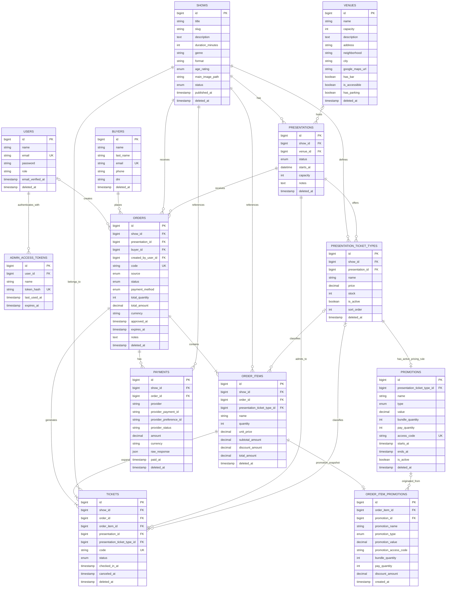

# Ticketera Database ERD

Este diagrama representa las tablas de negocio y autenticacion administrativa
definidas por las migraciones actuales.

## Cardinalidades principales

- Un show tiene muchas funciones.
- Un espacio puede alojar muchas funciones.
- Una funcion ofrece muchos tipos de entrada.
- Un tipo de entrada puede tener como maximo una promocion activa asociada.
- Un comprador puede tener muchas ordenes.
- Una orden pertenece a una funcion y contiene uno o mas items.
- Un item puede tener un unico snapshot historico de la promocion aplicada.
- Cada item genera una o mas entradas individuales.
- Una orden puede tener uno o mas registros de pago.
- Un usuario administrador puede crear ordenes manuales.

## Tablas internas de Laravel

No se incluyen en el grafico principal porque no forman parte directa del
dominio de venta:

- `password_reset_tokens`
- `sessions`
- `cache`
- `cache_locks`
- `jobs`
- `job_batches`
- `failed_jobs`
